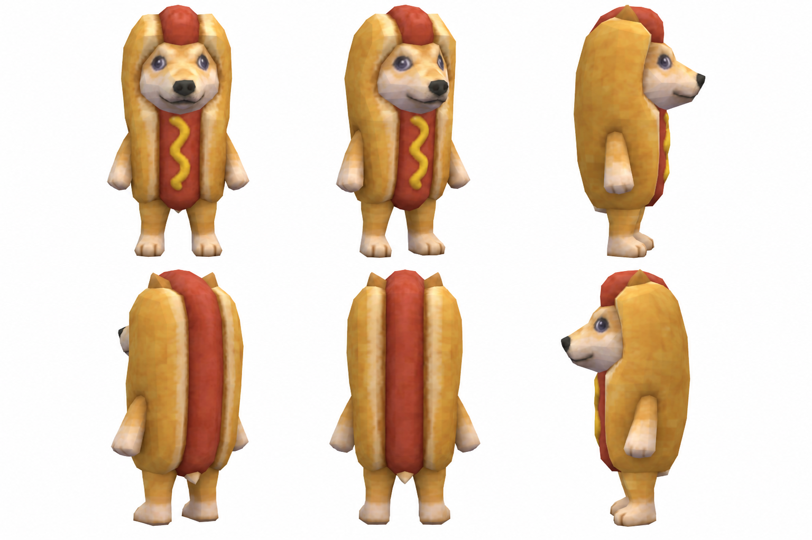

# Hotdog

A Nosimaj Media creative skill for the small bipedal canine integrated into a
vertical hot dog. Make original-PS2 images, short scenes, loops, fictional ads,
storyboards and video prompts from an ordinary idea.



**[Download the latest installable ZIP](https://github.com/nosimajtechnology/hotdog-engine/releases/latest/download/hotdog.zip)**
 · **[Releases](https://github.com/nosimajtechnology/hotdog-engine/releases)**

## Install and start

Download `hotdog.zip` from Releases. In a host supporting skill imports, import
the ZIP through its skills interface. For a filesystem-based skill host, extract
the `hotdog/` folder into its skills directory. The source-code archives GitHub
adds automatically are repository snapshots; `hotdog.zip` is the installable skill.

Invoke `@hotdog` or `$hotdog`, according to your host, then describe an idea:

> Make Hotdog waiting at an empty bus stop as an impossibly small bus arrives.

The approved character sheet is included. Image generation requires an available
image tool; video prompts can be used in an external provider. No API key or
video-generation service is bundled. Prompt-only requests do not spend video credits.

## Included

- IMAGE, MINI, SCENE, BUMPER and FAKE AD; CHARACTER and EPISODE by request.
- Original PS2 as the automatic default; researched PS1/Dreamcast translations
  on explicit request. No anime adapters.
- Classic Control, Direct Explore and Character Lock routes.
- H3 Max I2V/T2V/R2V prompt packaging, plus host-verified Seedance/Kling/generic adaptation.
- Separate identity, rendering, reference roles, continuity and narrow repairs.
- No music by default. Explicit creator choices persist across continuations.

See [validation status](docs/ACCEPTANCE.md) for executed checks and limits.
Supported prompt packaging is separate from measured Hotdog video performance.

## Development and releases

`hotdog/` is the complete runtime package. Documentation and tooling stay outside it.

```bash
python3 -m pip install -r requirements-dev.txt
python3 scripts/validate.py
python3 -m unittest discover -s tests -v
python3 scripts/package.py
```

Builds create `dist/hotdog.zip` and `dist/hotdog.zip.sha256`. The ZIP contains one
`hotdog/` directory with `SKILL.md`, metadata, references, version and approved asset.

Pushing a change to `hotdog/VERSION` on `main` runs validation and publishes that
version with both assets. A version tag, publishing a GitHub release, or manually
running the Release workflow can also build/upload them. See [release instructions](docs/RELEASING.md).
Version, skill title and release notes must agree. Existing releases are never
silently replaced with a different commit's files.

Engine by Nosimaj Media. Character ownership and formal community attribution
are unspecified; no partnership or ownership claim is implied. Third-party
game screenshots are researched at use time and are not bundled.
