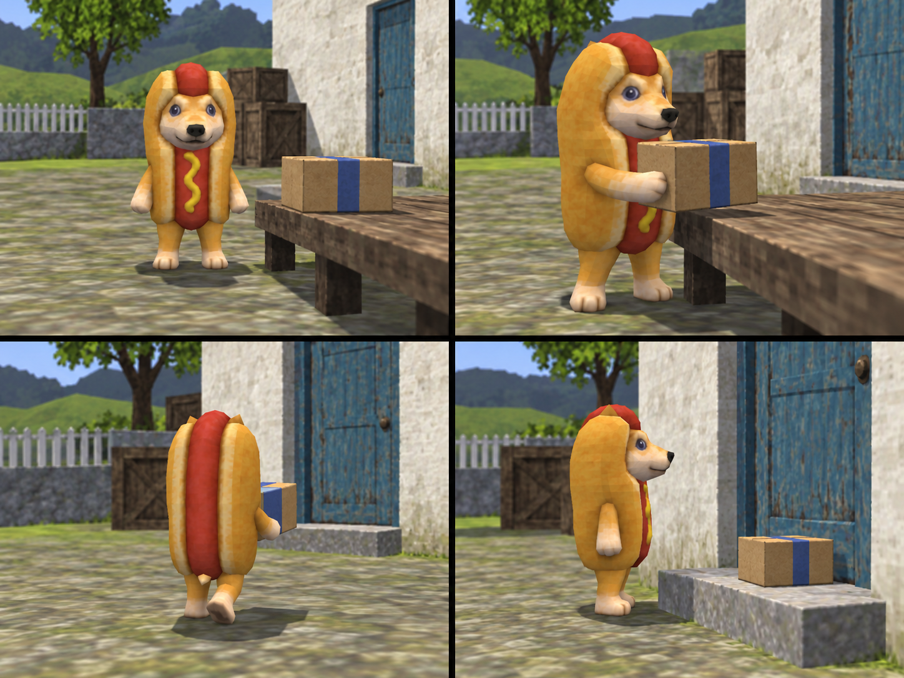
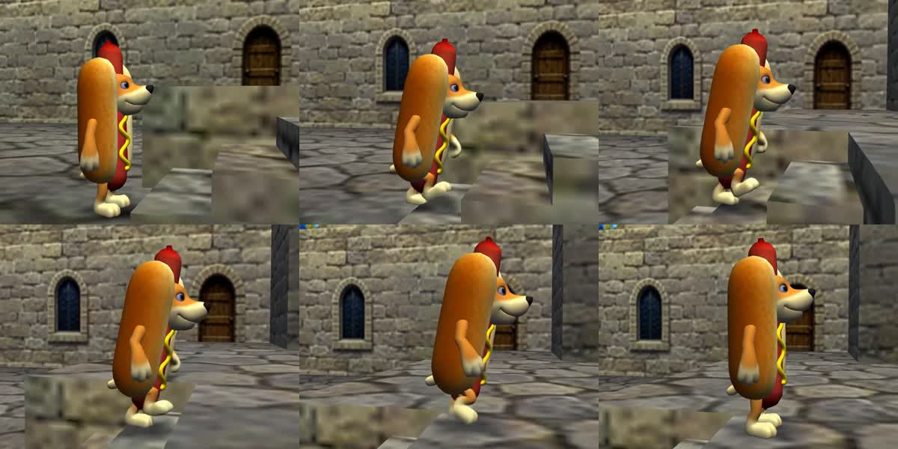
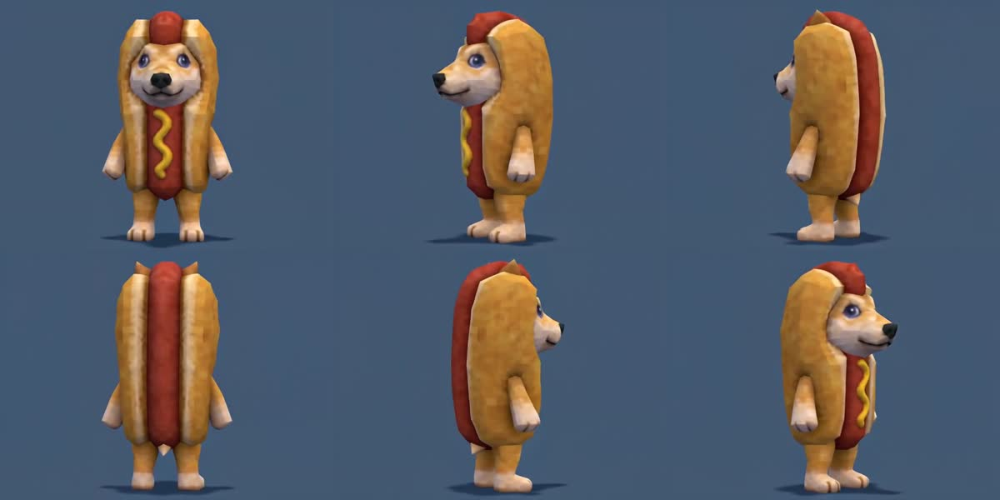
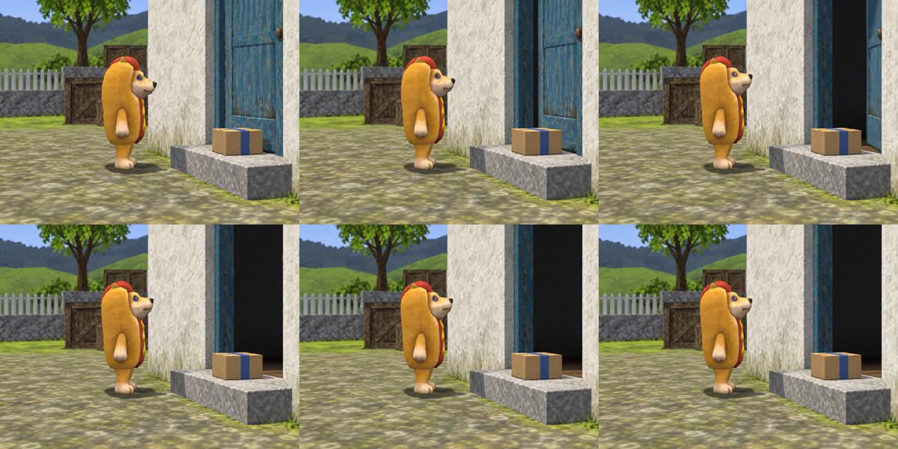

# Hotdog v1.0.0 acceptance record

Executed September 5, 2026. Implementation and distribution checks are separate
from generative performance. This record does not claim all 22 scenarios passed
through live image/video execution.

## Package and installation

- Skill-creator validation passed on the actual personal skill directory.
- Package validation passed for 17 runtime files: frontmatter, version/title,
  metadata, local links, reachable references, exact canonical PNG and icon.
- Six executable integrity tests passed, including reproducible isolated ZIP
  extraction, altered-asset rejection, broken/external-link rejection, unexpected
  module rejection and mismatched release-tag rejection.
- Installed Hotdog v1.0.0 was verified in the host's saved skill state. All 17
  files match this repository's runtime package byte for byte. Host-generated
  UI icon and metadata were retained in the distribution for parity.
- The only active registered style is flagship PS2. Excluded styles appear only
  in the explicit availability boundary, not active assets/presets/aliases.
- No third-party game screenshots, other-engine dependencies or credentials ship.

## Independent prompt trials

Three isolated skill-use trials produced actual deliverables, without seeing
the implementation author's expected outputs:

| Trial | Result |
| --- | --- |
| [Three T2V concepts](acceptance/t2v-tryout.md) | Three distinct complete prompts: 2,883 / 3,193 / 3,255 characters. No reference tokens/uploads, full textual identity, 15-second plans, no music. |
| [R2V bumper](acceptance/r2v-tryout.md) | 2,631 characters; one sheet only, single continuous character turn, no opening-frame claim or board gate. |
| [I2V continuation](acceptance/continuation-tryout.md) | 1,768 characters; uses supplied approved frame, skips board, parcel remains delivered, no music persists. |

The first two trials inspected original-platform screenshots independently.
R2V trial checked the live fal API page. T2V trial used the dated bundled schema
snapshot; the implementation author separately checked live official schemas
before actual provider submission. No trial invented API controls.

## Visual execution

[Grounding record](acceptance/grounding.md) documents the three original-PS2
screenshots inspected for the implementation's visual tests.

Generated a four-shot parcel sequence covering front, profile, rear, reachable
paw contact and delivered-object end-state. First result had excessive background
blur and detailed surfaces. One rendering-only repair reduced those issues and
retained character construction/action progression. Fine environment detail is
still a subjective fidelity limit; this is a generated interpretation, not a
claim that the image is an extracted original game asset.

[Continuation frame](acceptance/continuation-frame.png) was generated from the
delivered-parcel end-state as a separate test fixture. It preserves the parcel
on the doorstep and empty paws. Test fixtures do not establish new character canon.

## Actual H3 results

All three routes were submitted and returned video. Inputs, provider output URLs
and expanded prompts are in [video-runs.json](acceptance/video-runs.json).
[Video metadata and SHA-256 hashes](acceptance/video-metadata.json) identify
the inspected files. Contact sheets preserve sampled visual evidence in the repo;
provider-hosted video URLs may depend on the provider's retention policy.

| Route / test | Observation | Limit |
| --- | --- | --- |
| T2V / three shallow steps | Bipedal progression and low-poly game treatment; no obvious extra limbs in sampled frames | Face/proportions differ from canon. Exploration supported; canonical identity failed this sample. |
| R2V / one-sheet model viewer | Recognizable sheet identity, front/profile/plain rear, stable bun construction; completed a full rotation back to front | One narrow rotation sample, not general motion reliability or a pixel-perfect loop claim. |
| I2V / door opens after delivery | Starts from the scene fixture; delivered parcel stays put, paws empty, door opens and Hotdog waits | One quiet one-take continuation, not a complex multi-shot combat/contact benchmark. |

All requested six seconds at 480P; actual streams were 640x480 and about 6.58
seconds (container/audio about 6.59). Exact duration requires an edit. Audio
intent was retained in prompts; no separate listening-based audio certification
was performed. Model-reported “fully preserved” text is not validation evidence.
R2V and I2V have been exercised on these specific Hotdog cases; T2V identity
drift remains visible. No broad claim of proven Hotdog consistency is made.

## PRD scenario coverage

The unmodified requests and pass conditions are in
[acceptance-scenarios.json](../tests/acceptance-scenarios.json).
“Source reviewed” means instructions were inspected, not behavior proven by a
live output. These unexecuted scenarios remain candidates for later regression work.

| ID | Evidence / status |
| --- | --- |
| H01 | Source reviewed: compact no-idea menu. |
| H02 | Source reviewed: plain premise -> IMAGE/default PS2/no style gate. Exact bus-stop image not executed. |
| H03 | Exact approved turnaround inspected; dimensions/RGB/hash verified. No new alpha sheet generated. |
| H04 | Rear checked in generated board and R2V samples; no rear face/mustard. |
| H05 | Actual T2V stairs: bipedal movement observed, canonical identity drift remains. Partial. |
| H06 | Still-board pickup/contact observed; animated pickup not executed. Partial. |
| H07 | Source reviewed: one-take/no board and explicit provider-duration handling. Four-second run not executed. |
| H08 | Actual R2V full turn, no required board. Duration overrun means exact six-second/seamless-loop criterion not fully met. |
| H09 | Source reviewed: frame/board approvals. Full interactive classic approval sequence not executed. |
| H10 | Independent approved-frame I2V/no-board prompt plus actual I2V scene-frame input. |
| H11 | Independent and live R2V used one actual image URL, sheet first/only. |
| H12 | Three independent complete T2V prompt deliverables; measured lengths above. |
| H13 | Separate crossover identity/reference rules source reviewed; no crossover generated. |
| H14 | One narrow rendering repair executed. Extra-arm/shot-3-specific edit not executed. |
| H15 | Independent continuation prompt, new scene fixture and I2V preserve delivered-parcel state. Full four-board episode not executed. |
| H16 | Named-title grounding rules source reviewed; specific GTA scene not executed. |
| H17 | Explicit adjacent PS1 routing source reviewed; PS1 output not executed. |
| H18 | Registry/inventory inspected: excluded style absent; no inherited adapter files. |
| H19 | No-music intent retained in continuation prompts. Audio output not independently auditioned. |
| H20 | Three prompt-only trials; final prompt lengths measured after writing. |
| H21 | Honest fallback path source reviewed; search-unavailable simulation not executed. |
| H22 | Actual isolated archive extraction and resource validation passed without other engines. |

## Release gate

The GitHub actions run validation, integrity tests and package build before
publishing. These deterministic checks cannot turn untested visual cases into
passes. A successful workflow verifies release mechanics; the coverage and
limitations above remain part of v1.0.0.
